# Guia pré-curso para instalação do Java 21 no Windows 11 Enterprise

## Objetivo deste guia

Este é um procedimento de preparação do computador para o curso de reskilling Cobol para Java. Ao terminar, o computador deverá estar com o JDK 21 instalado, a variável `JAVA_HOME` configurada, o diretório `%JAVA_HOME%\bin` incluído na variável `Path` e os comandos `java` e `javac` funcionando no Prompt de Comando do Windows.

Este guia é propositalmente operacional. As explicações sobre JDK, compilação, execução e demais conceitos serão apresentadas durante o curso.

O procedimento foi escrito para:

- Windows 11 Enterprise de 64 bits;
- Eclipse Temurin JDK 21 LTS;
- instalador do Windows no formato `.msi`;
- testes realizados no **Prompt de Comando**, também chamado de **CMD**.

> **IMPORTANTE — faça a instalação no computador físico:** todo este procedimento deve ser realizado no Windows do computador físico. **Não instale o Java dentro da VDI utilizada no trabalho.** Antes de começar, minimize ou feche a VDI e confirme que você está operando o Windows da própria máquina. Se alguma tela ou comportamento for diferente do apresentado neste guia, interrompa o procedimento e procure o instrutor.

## Resultado esperado

Ao final, os quatro comandos abaixo deverão funcionar em uma nova janela do Prompt de Comando:

```bat
echo %JAVA_HOME%
java -version
javac -version
where java
```

Os resultados deverão indicar:

- um caminho real de instalação do JDK 21 para `JAVA_HOME`;
- versão principal `21` no comando `java -version`;
- versão principal `21` no comando `javac -version`;
- um executável `java.exe` localizado no diretório configurado para o JDK 21.

## Antes de começar

### 0. Confirme que você está no computador físico

Este procedimento não deve ser executado dentro da VDI.

1. Verifique se você está no Windows do computador físico.
2. Se a VDI estiver aberta em tela cheia, saia do modo de tela cheia, minimize-a ou feche-a.
3. Confirme que o Explorador de Arquivos, as Configurações e o menu Iniciar pertencem ao computador físico.
4. Somente depois dessa conferência, prossiga com a instalação.

Se você não conseguir distinguir o computador físico da VDI, não inicie a instalação. Procure o instrutor.

### 1. Salve o que estiver aberto

Salve os documentos e trabalhos em andamento. Normalmente não é necessário reiniciar o computador, mas uma reinicialização poderá ser usada no diagnóstico se o Windows não atualizar as variáveis para novos processos.

### 2. Feche terminais e ferramentas de desenvolvimento

Feche todas as janelas já abertas de:

- Prompt de Comando;
- PowerShell;
- Windows Terminal;
- Visual Studio Code;
- IntelliJ IDEA;
- Eclipse;
- outras ferramentas que possam estar usando Java.

Esses programas recebem uma cópia das variáveis de ambiente quando são iniciados. Se permanecerem abertos durante a configuração, poderão continuar exibindo valores antigos.

### 3. Confirme que o Windows é de 64 bits

1. Clique com o botão direito no botão **Iniciar**.
2. Clique em **Sistema**.

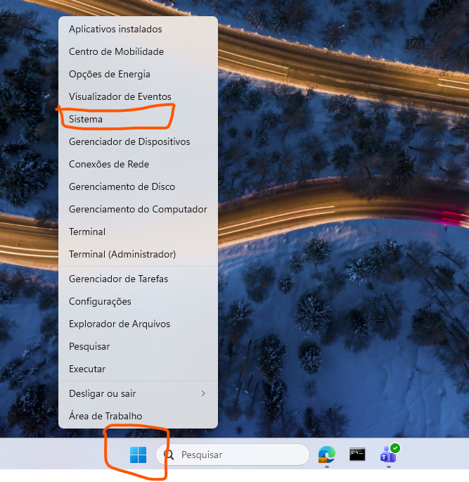

*Figura 1 — Abertura da página Sistema pelo menu do botão Iniciar.*

3. Na tela **Sistema > Sobre**, localize **Tipo de sistema**.
4. Confirme que aparece uma informação equivalente a:

   ```text
   Sistema operacional de 64 bits, processador baseado em x64
   ```

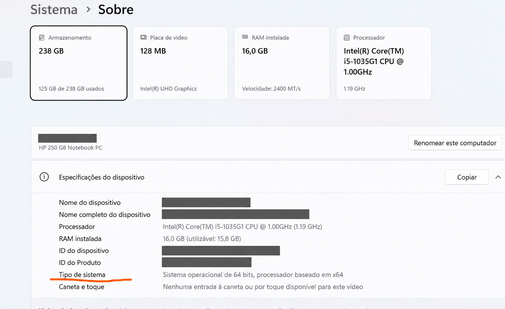

*Figura 2 — Conferência da arquitetura em Sistema > Sobre.*

Se aparecer `ARM64`, não prossiga com o instalador x64 descrito neste guia. Procure o instrutor.

### 4. Verifique se o Windows permite continuar

Durante a instalação, o Windows pode exibir uma solicitação de confirmação ou pedir credenciais administrativas. Se forem solicitadas credenciais que você não possui, cancele o procedimento e procure o instrutor.

## Parte 1 — Baixar o JDK 21

### 1. Acesse o site oficial

1. Abra o navegador.
2. Acesse a página oficial de versões do Eclipse Temurin:

   <https://adoptium.net/temurin/releases/>

3. Antes de baixar, confirme que o endereço exibido na barra do navegador pertence ao domínio:

   ```text
   adoptium.net
   ```


*Figura 3 — Página oficial de versões do Eclipse Temurin.*

Não baixe o instalador em sites de terceiros.

### 2. Selecione o pacote correto

Na página de downloads, selecione os seguintes filtros:

| Campo | Valor a selecionar |
| --- | --- |
| Versão | `21 - LTS` |
| Sistema operacional | `Windows` |
| Arquitetura | `x64` |
| Tipo de pacote | `JDK` |
| JVM | `HotSpot` |

Se a página apresentar mais de uma atualização da versão 21, use a atualização estável mais recente disponibilizada na página. O número completo pode variar, por exemplo `21.0.x`; o que precisa permanecer igual é a versão principal `21`.

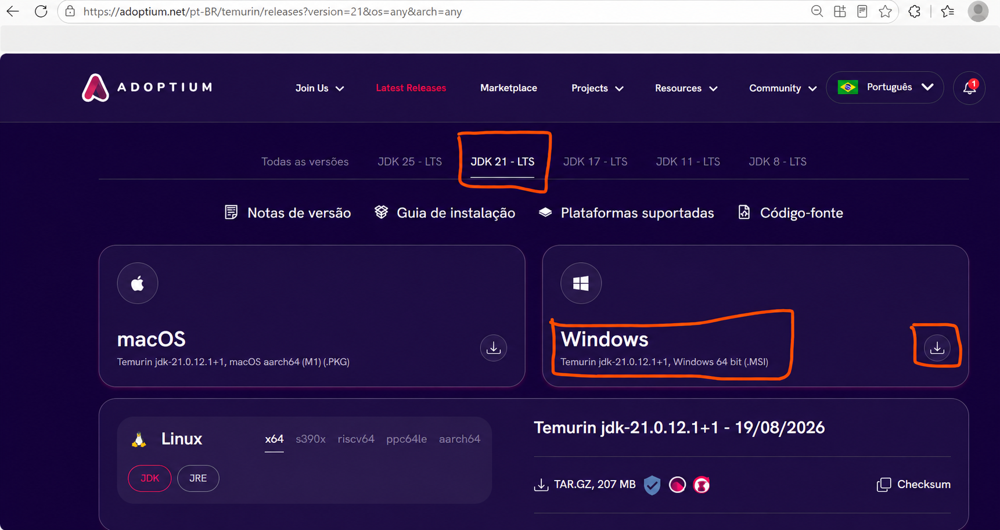

*Figura 4 — Seleção do JDK 21 LTS para Windows de 64 bits no formato MSI.*

### 3. Escolha o arquivo MSI

1. Localize a opção de download identificada como **MSI** ou **`.msi`**.
2. Não selecione:
   - o pacote `JRE`;
   - o arquivo `.zip`;
   - o instalador para `x86`;
   - o instalador para outro sistema operacional.
3. Clique no download do arquivo `.msi`.
4. Aguarde o término do download.

Algumas configurações do Microsoft Edge podem avisar que o arquivo `.msi` “pode danificar seu dispositivo”. Se o arquivo foi iniciado no domínio oficial `adoptium.net`, confira novamente o nome do pacote e clique em **Manter**. Se o endereço ou o nome do arquivo for diferente do esperado, exclua o download e retorne ao site oficial.

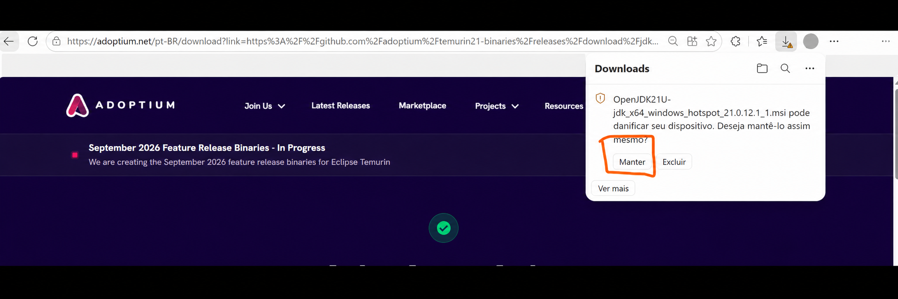

*Figura 5 — Confirmação para manter o instalador baixado do site oficial.*

O nome do arquivo será parecido com o exemplo abaixo, mas os números da atualização podem ser diferentes:

```text
OpenJDK21U-jdk_x64_windows_hotspot_21.0.x_x.msi
```

Quando o download terminar, clique no ícone de pasta do painel de downloads para abrir o local do arquivo. Dependendo da versão do navegador, também pode aparecer a opção **Mostrar na pasta**.

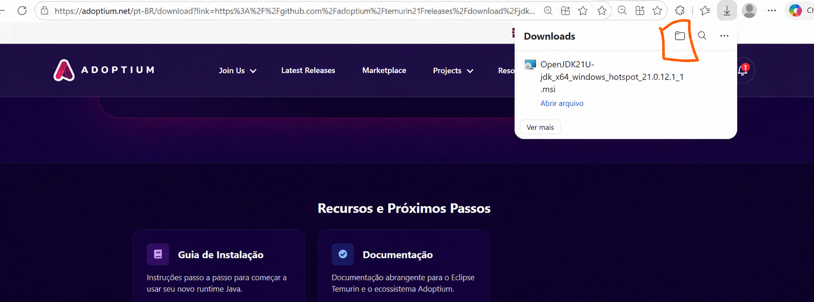

*Figura 6 — Abertura da pasta em que o instalador foi salvo.*

### 4. Localize o arquivo baixado

1. Abra o **Explorador de Arquivos**.
2. No painel esquerdo, clique em **Downloads**.
3. Localize o arquivo que:
   - começa com `OpenJDK21U`;
   - contém `jdk`;
   - contém `x64_windows_hotspot`;
   - termina em `.msi`.

Se as extensões estiverem ocultas:

1. Na barra superior do Explorador de Arquivos, clique em **Exibir**.
2. Abra **Mostrar**.
3. Marque **Extensões de nomes de arquivos**.
4. Confirme que o arquivo termina em `.msi`.

## Parte 2 — Instalar o JDK 21

### 1. Inicie o instalador

1. Na pasta **Downloads**, dê dois cliques no arquivo `.msi`.
2. Se aparecer a janela **Abrir Arquivo — Aviso de Segurança**, confira se o fornecedor indicado é **Eclipse Foundation** e clique em **Executar**.
3. Se aparecer a janela **Controle de Conta de Usuário**, confira se o instalador se refere ao Eclipse Temurin ou à Eclipse Adoptium.
4. Clique em **Sim** depois de confirmar que o instalador foi baixado do site oficial.

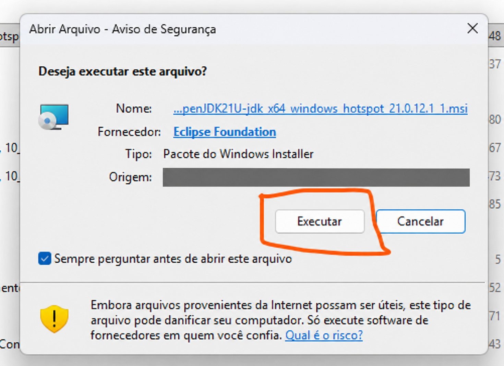

*Figura 7 — Confirmação da execução do instalador.*

Se a janela solicitar credenciais administrativas e você não as possuir, clique em **Não** ou **Cancelar** e procure o instrutor.

### 2. Avance pela tela inicial

1. Aguarde a abertura do assistente de instalação.
2. Na tela inicial, clique em **Next**.

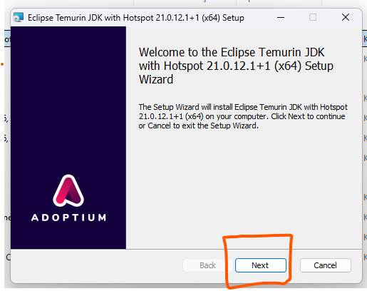

*Figura 8 — Tela inicial do assistente de instalação.*

3. Na tela do contrato, marque **I accept the terms in the License Agreement**.
4. Clique em **Next**.

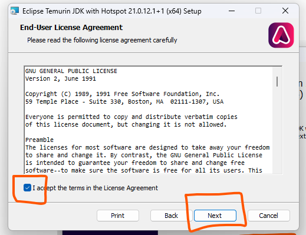

*Figura 9 — Aceite do contrato de licença para prosseguir.*

### 3. Revise a tela Custom Setup

O instalador poderá mostrar uma tela chamada **Custom Setup**. Nela aparecem o local de instalação e recursos opcionais.

1. Mantenha instalado o recurso principal do JDK.
2. Mantenha o diretório de instalação padrão.
3. O diretório padrão costuma ficar dentro de:

   ```text
   C:\Program Files\Eclipse Adoptium\
   ```

4. Para que este guia realize a configuração manual e deixe o `Path` dependente de `JAVA_HOME`, desative, se a tela permitir, os recursos com nomes equivalentes a:
   - **Add to PATH**;
   - **Set JAVA_HOME variable** ou **Update JAVA_HOME**.
5. Para desativar um recurso nessa tela, clique no ícone ao lado do nome do recurso e escolha a opção equivalente a **Entire feature will be unavailable**. O ícone normalmente passa a mostrar um `X` vermelho.
6. Não desative o recurso principal de instalação do JDK.

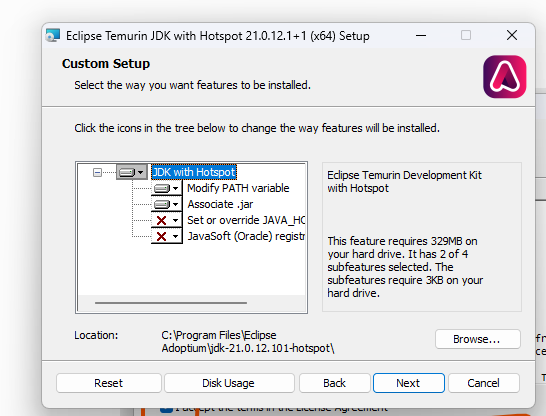

*Figura 10 — Recursos opcionais e diretório de instalação do JDK.*

Na imagem, **Modify PATH variable** aparece habilitado e **Set or override JAVA_HOME variable** aparece desabilitado. Para seguir a configuração manual deste guia, deixe os dois recursos desabilitados. Caso mantenha **Modify PATH variable** habilitado, não adicione depois uma segunda entrada equivalente ao mesmo JDK.

Se o instalador já tiver sido executado com as opções automáticas, não é necessário desinstalar o Java. Continue o guia normalmente. Na configuração do `Path`, apenas evite manter entradas duplicadas.

### 4. Conclua a instalação

1. Clique em **Next**.
2. Clique em **Install**.
3. Aguarde a cópia dos arquivos.
4. Se o Windows solicitar confirmação, clique em **Sim**.
5. Quando a instalação terminar, clique em **Finish**.

Não abra ainda uma IDE. Primeiro serão configuradas e testadas as variáveis de ambiente.

## Parte 3 — Localizar a pasta exata do JDK

O valor de `JAVA_HOME` precisa apontar para a pasta principal do JDK. Ele não deve ser preenchido por tentativa e não deve apontar diretamente para a subpasta `bin`.

### 1. Abra a pasta de instalação

1. Abra o **Explorador de Arquivos**.
2. Clique na barra de endereços.
3. Digite:

   ```text
   C:\Program Files\Eclipse Adoptium
   ```

4. Pressione **Enter**.

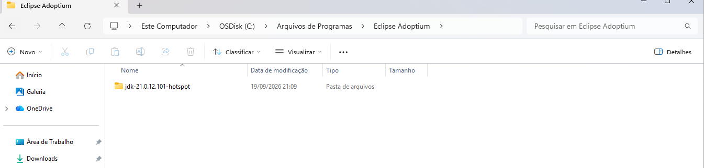

*Figura 11 — Pasta criada pela instalação do Eclipse Temurin JDK 21.*

### 2. Identifique a pasta da versão 21

Dentro de `Eclipse Adoptium`, procure uma pasta cujo nome comece com `jdk-21`. Exemplos possíveis:

```text
jdk-21.0.8.9-hotspot
jdk-21.0.9.10-hotspot
```

Os números podem ser diferentes. Isso é normal.

Se existirem várias pastas, selecione a atualização mais recente da versão principal 21, desde que ela corresponda à instalação feita agora.

### 3. Confirme que a pasta é realmente um JDK

1. Abra a pasta que começa com `jdk-21`.
2. Confirme que existe uma subpasta chamada:

   ```text
   bin
   ```

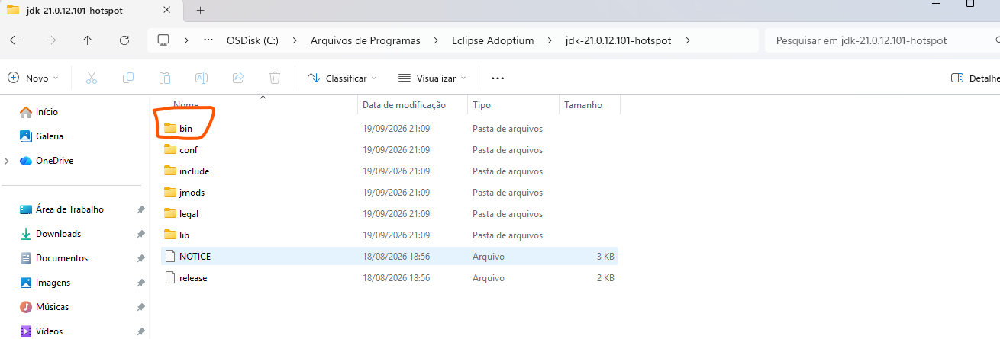

*Figura 12 — Localização da subpasta `bin` dentro da pasta principal do JDK.*

3. Abra a pasta `bin`.
4. Confirme que existem, entre outros arquivos:

   ```text
   java.exe
   javac.exe
   ```

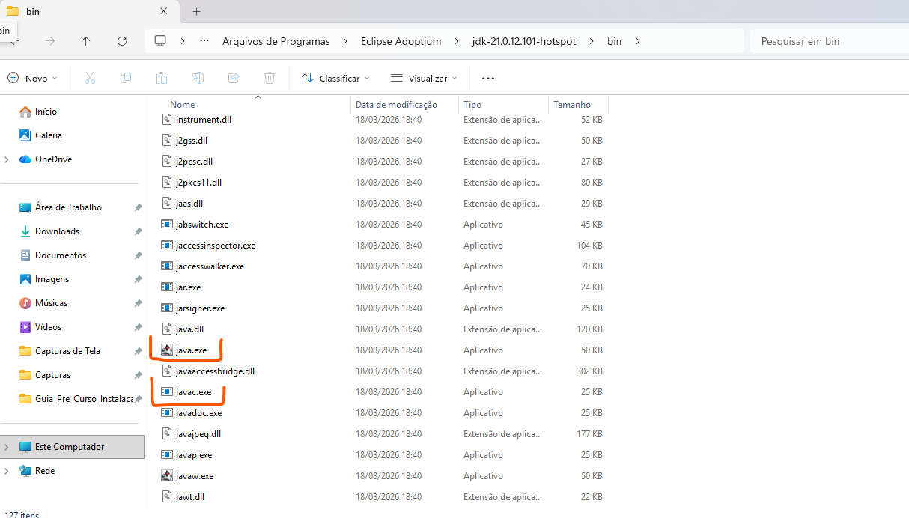

*Figura 13 — Confirmação da presença de `java.exe` e `javac.exe`.*

5. Volte uma pasta, de modo que a barra de endereços mostre novamente a pasta principal `jdk-21...`.

Se `java.exe` existir, mas `javac.exe` não existir, provavelmente foi instalado um JRE ou outro pacote incompleto. Volte à Parte 1 e confirme que o tipo de pacote selecionado é **JDK**.

### 4. Copie o caminho da pasta principal

1. Com a pasta principal do JDK aberta, clique uma vez na barra de endereços do Explorador de Arquivos.
2. O caminho completo ficará selecionado como texto.
3. Pressione `Ctrl + C` para copiá-lo.
4. Cole temporariamente no Bloco de Notas, se quiser conferir antes de continuar.

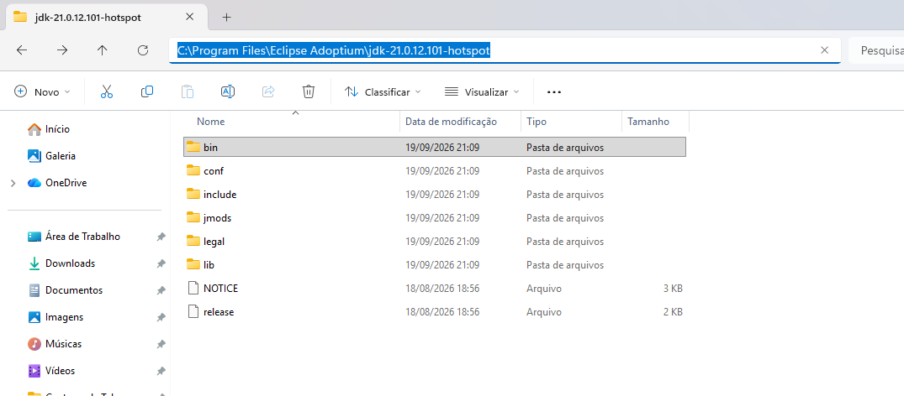

*Figura 14 — Seleção do caminho da pasta principal do JDK para cópia.*

O valor copiado deverá ser parecido com:

```text
C:\Program Files\Eclipse Adoptium\jdk-21.0.x.x-hotspot
```

O valor de `JAVA_HOME` deve terminar no nome da pasta do JDK.

**Valor correto:**

```text
C:\Program Files\Eclipse Adoptium\jdk-21.0.x.x-hotspot
```

**Valores incorretos:**

```text
C:\Program Files\Eclipse Adoptium
C:\Program Files\Eclipse Adoptium\jdk-21.0.x.x-hotspot\bin
"C:\Program Files\Eclipse Adoptium\jdk-21.0.x.x-hotspot"
```

Não inclua `\bin` no `JAVA_HOME`. Não coloque aspas no valor, mesmo que o caminho contenha espaços.

## Parte 4 — Abrir a janela de Variáveis de Ambiente

### Método principal pela pesquisa do Windows

1. Clique no botão **Iniciar** ou pressione a tecla `Windows`.
2. Digite:

   ```text
   variáveis de ambiente
   ```

3. Nos resultados, clique em **Editar as variáveis de ambiente do sistema**.

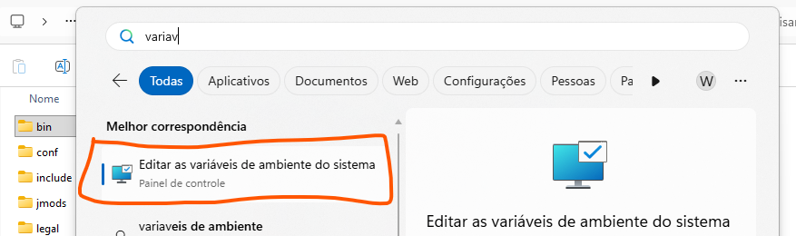

*Figura 15 — Localização da opção de edição das variáveis de ambiente.*

4. A janela **Propriedades do Sistema** deverá abrir na guia **Avançado**.
5. Na parte inferior da janela, clique em **Variáveis de Ambiente...**.

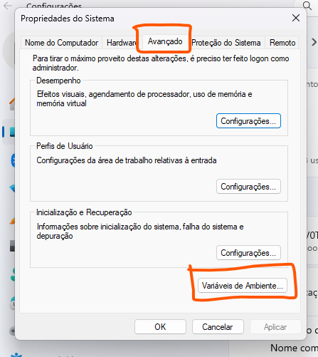

*Figura 16 — Abertura da janela Variáveis de Ambiente.*

### Método alternativo se a pesquisa não encontrar a opção

1. Pressione `Windows + R`.
2. Na janela **Executar**, digite:

   ```text
   sysdm.cpl
   ```

3. Pressione **Enter**.
4. Abra a guia **Avançado**.
5. Clique em **Variáveis de Ambiente...**.

## Parte 5 — Escolher entre variáveis do usuário e do sistema

A janela **Variáveis de Ambiente** é dividida em duas áreas:

1. **Variáveis de usuário para nome-do-usuário**: afetam apenas a conta atual do Windows.
2. **Variáveis do sistema**: afetam todas as contas do computador e normalmente exigem permissão administrativa.

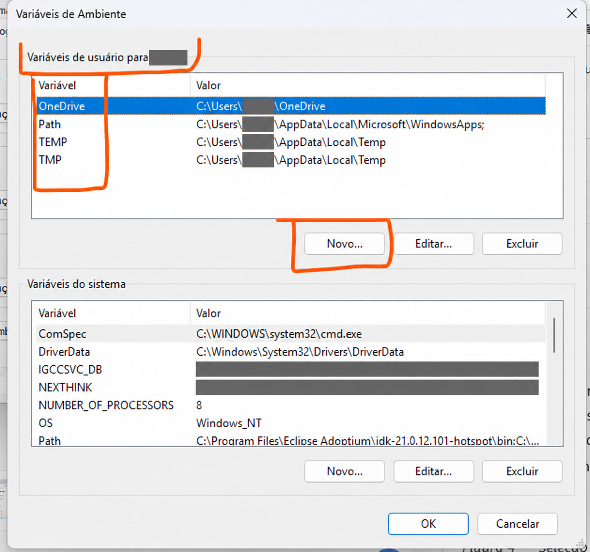

*Figura 17 — Área das variáveis do usuário, utilizada neste procedimento.*

Configure `JAVA_HOME` e `Path` em **Variáveis de usuário**, como demonstrado neste guia.

Use a mesma área para as duas configurações. Não crie `JAVA_HOME` nas variáveis do usuário e `%JAVA_HOME%\bin` no `Path` do sistema, nem o contrário.

## Parte 6 — Criar ou corrigir JAVA_HOME

### 1. Verifique se JAVA_HOME já existe

Na área **Variáveis de usuário**, procure uma linha cujo nome seja exatamente:

```text
JAVA_HOME
```

O Windows não diferencia maiúsculas de minúsculas nos nomes das variáveis, mas use `JAVA_HOME` em letras maiúsculas para manter o padrão.

### 2. Se JAVA_HOME não existir

1. Na área **Variáveis de usuário**, clique em **Novo...**.
2. No campo **Nome da variável**, digite exatamente:

   ```text
   JAVA_HOME
   ```

3. No campo **Valor da variável**, cole o caminho da pasta principal do JDK copiado anteriormente. Exemplo:

   ```text
   C:\Program Files\Eclipse Adoptium\jdk-21.0.x.x-hotspot
   ```

4. Confirme que o valor:
   - aponta para a pasta `jdk-21...` realmente existente;
   - não termina em `\bin`;
   - não está entre aspas;
   - não contém o texto literal `x.x` usado apenas nos exemplos deste guia.
5. Clique em **OK**.

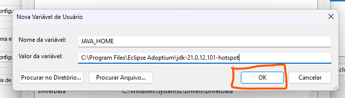

*Figura 18 — Criação da variável `JAVA_HOME` com o caminho da pasta principal do JDK.*

### 3. Se JAVA_HOME já existir

1. Selecione `JAVA_HOME`.
2. Clique em **Editar...**.
3. Antes de alterar, anote o valor anterior e procure o instrutor.
4. Substitua o valor pelo caminho real do JDK 21 instalado.
5. Faça as mesmas quatro conferências da seção anterior.
6. Clique em **OK**.

Se a edição estiver bloqueada ou já existir uma configuração diferente, não apague nada por conta própria. Registre o valor encontrado e procure o instrutor.

## Parte 7 — Adicionar o Java ao Path

### 1. Abra a edição do Path

1. Ainda na área **Variáveis de usuário**, localize a variável chamada `Path`.
2. Selecione `Path`.
3. Clique em **Editar...**.

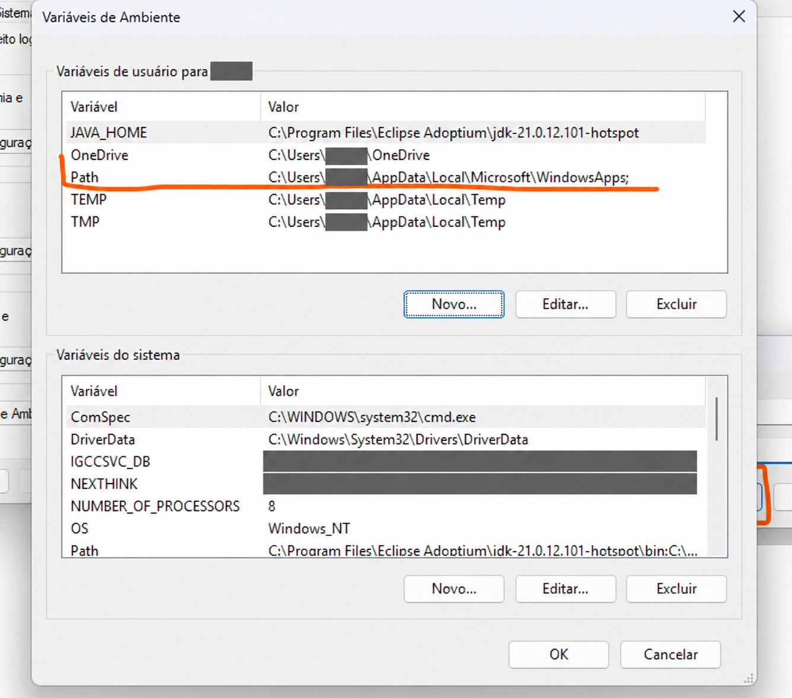

*Figura 19 — Seleção da variável `Path` do usuário.*

Na Figura 19, o valor resumido do `Path` do sistema já começa com um caminho direto para `Eclipse Adoptium\jdk-21...\bin`. Isso acontece quando o recurso automático **Modify PATH variable** permaneceu habilitado durante a instalação. Nesse caso, não crie outra entrada equivalente. Se o seu `Path` estiver diferente do apresentado no procedimento, procure o instrutor antes de alterá-lo.

Não apague a variável `Path` e não substitua todo o conteúdo dela. Ela contém caminhos usados por diversos programas.

Se não existir uma variável `Path` na área **Variáveis de usuário**:

1. Clique em **Novo...** na área **Variáveis de usuário**.
2. No campo **Nome da variável**, digite `Path`.
3. No campo **Valor da variável**, digite `%JAVA_HOME%\bin`.
4. Clique em **OK**.
5. Pule para a seção **Salvar todas as alterações**.

Não altere uma variável com nome parecido, como `PATHEXT`. Ela tem outra finalidade.

Depois de abrir a variável `Path`, cada caminho configurado aparece em uma linha separada. Para criar uma entrada, clique em **Novo**.

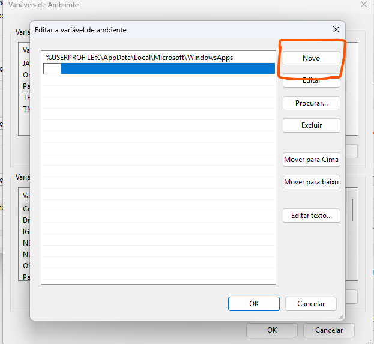

*Figura 20 — Inclusão de uma nova linha no `Path` do usuário.*

### 2. Procure entradas Java já existentes

Na lista de entradas do `Path`, procure itens como:

```text
%JAVA_HOME%\bin
C:\Program Files\Eclipse Adoptium\jdk-...\bin
C:\Program Files\Java\jdk-...\bin
C:\Program Files\Common Files\Oracle\Java\javapath
```

Considere as seguintes situações:

- Se já existir exatamente `%JAVA_HOME%\bin`, não crie uma segunda entrada igual.
- Se existir um caminho direto para o mesmo JDK 21, prefira manter somente `%JAVA_HOME%\bin` para evitar duplicação.
- Se existirem caminhos de versões antigas, não os apague. Procure o instrutor antes de continuar.
- Se a lista estiver bloqueada, procure o instrutor.

### 3. Adicione a entrada baseada em JAVA_HOME

1. Clique em **Novo**.
2. Digite exatamente:

   ```text
   %JAVA_HOME%\bin
   ```

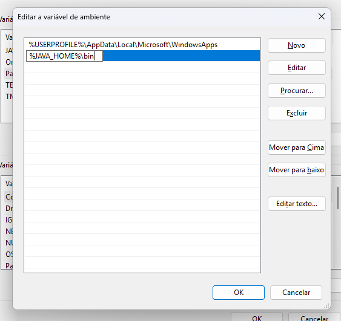

*Figura 21 — Entrada `%JAVA_HOME%\bin` adicionada ao `Path` do usuário.*

3. Não substitua `%JAVA_HOME%` pelo texto `JAVA_HOME` sem os sinais de porcentagem.
4. Não coloque aspas.
5. Não acrescente `java.exe` ou `javac.exe` ao final.
6. Não use dois `\bin`.

**Entrada correta:**

```text
%JAVA_HOME%\bin
```

**Entradas incorretas:**

```text
JAVA_HOME\bin
%JAVA_HOME%
%JAVA_HOME%\bin\java.exe
"%JAVA_HOME%\bin"
%JAVA_HOME%\bin\bin
```

### 4. Posicione a entrada do JDK 21

1. Selecione `%JAVA_HOME%\bin`.
2. Use **Mover para cima** até que essa entrada fique acima de outras entradas relacionadas a Java.
3. Não é necessário colocá-la obrigatoriamente como a primeira entrada de todo o `Path`; é suficiente que apareça antes de caminhos de outras versões do Java.

A ordem importa porque o Windows procura os executáveis seguindo a sequência das entradas do `Path`.

### 5. Salve todas as alterações

1. Na janela **Editar variável de ambiente**, clique em **OK**.
2. Na janela **Variáveis de Ambiente**, clique em **OK**.
3. Na janela **Propriedades do Sistema**, clique em **OK**.

Se uma das janelas for fechada por **Cancelar**, as alterações feitas nela poderão não ser salvas.

## Parte 8 — Abrir um novo Prompt de Comando

Os testes deste guia devem ser realizados em uma janela aberta **depois** da configuração.

1. Feche qualquer Prompt de Comando que ainda esteja aberto.
2. Clique no botão **Iniciar**.
3. Digite:

   ```text
   cmd
   ```

4. Clique em **Prompt de Comando**.

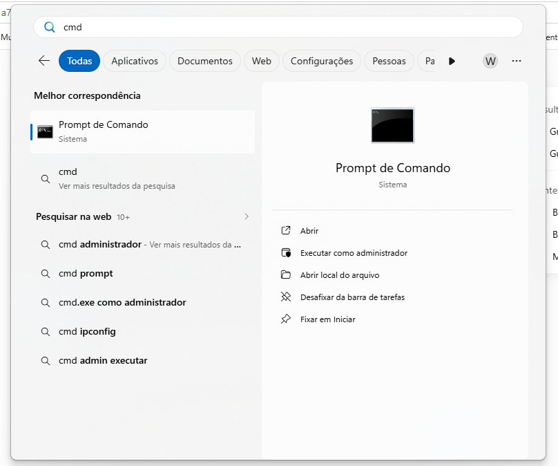

*Figura 22 — Abertura do Prompt de Comando pela pesquisa do Windows.*

5. Confirme que a janela aberta tem aparência de terminal e apresenta um prompt parecido com:

   ```text
   C:\Users\seu.usuario>
   ```

> **Atenção:** `echo %JAVA_HOME%` é a sintaxe usada no Prompt de Comando. Se você executar esse texto no PowerShell, poderá receber o próprio texto `%JAVA_HOME%` em vez do valor esperado. Para seguir este guia, abra especificamente o **Prompt de Comando**.

## Parte 9 — Testar JAVA_HOME

### 1. Exiba o valor

No Prompt de Comando, digite:

```bat
echo %JAVA_HOME%
```

Pressione **Enter**.

### 2. Confira o resultado

O resultado deverá ser o caminho real configurado, por exemplo:

```text
C:\Program Files\Eclipse Adoptium\jdk-21.0.x.x-hotspot
```

O texto `x.x` não aparecerá na instalação real; em seu lugar estarão os números da atualização instalada.

### 3. Interprete resultados incorretos

Se aparecer:

```text
%JAVA_HOME%
```

a variável não foi encontrada nessa nova janela. Verifique se:

- a variável foi criada com o nome correto;
- todas as janelas foram confirmadas com **OK**;
- o Prompt de Comando foi fechado e aberto novamente;
- `JAVA_HOME` e o `Path` foram configurados na mesma área, conforme a orientação deste guia.

Se não aparecer nada depois do comando, o valor pode ter sido salvo vazio. Abra novamente as Variáveis de Ambiente e corrija-o.

Se aparecer um caminho terminado em `\bin`, edite `JAVA_HOME` e remova somente o `\bin` final.

Se aparecer um caminho cercado por aspas, edite `JAVA_HOME` e remova as aspas.

### 4. Confirme que a pasta existe

Execute:

```bat
if exist "%JAVA_HOME%\bin\java.exe" (echo JAVA encontrado) else (echo JAVA NAO encontrado)
```

O resultado esperado é:

```text
JAVA encontrado
```

Depois execute:

```bat
if exist "%JAVA_HOME%\bin\javac.exe" (echo JAVAC encontrado) else (echo JAVAC NAO encontrado)
```

O resultado esperado é:

```text
JAVAC encontrado
```

Se qualquer resultado informar `NAO encontrado`, o caminho salvo em `JAVA_HOME` está incorreto ou o pacote instalado não é um JDK completo.

## Parte 10 — Testar a versão do Java

### 1. Execute java -version

No mesmo Prompt de Comando, digite:

```bat
java -version
```

Pressione **Enter**.

O resultado pode começar de maneira semelhante a:

```text
openjdk version "21.0.x" ...
```

As linhas e os números completos variam conforme a atualização instalada. Para este guia, o ponto decisivo é a versão principal ser `21`.

### 2. Verifique o executável encontrado pelo Windows

Execute:

```bat
where java
```

O primeiro caminho mostrado deve corresponder ao diretório `bin` do JDK 21 configurado em `JAVA_HOME`, por exemplo:

```text
C:\Program Files\Eclipse Adoptium\jdk-21.0.x.x-hotspot\bin\java.exe
```

Se forem mostrados vários caminhos, o Windows usará primeiro o que aparece na primeira linha.

### 3. Compare o comando do Path com o JAVA_HOME

Execute diretamente o `java.exe` localizado dentro de `JAVA_HOME`:

```bat
"%JAVA_HOME%\bin\java.exe" -version
```

Compare esse resultado com:

```bat
java -version
```

Os dois comandos devem indicar a versão principal 21. Se o primeiro indicar 21 e o segundo indicar outra versão, o problema está na ordem ou no conteúdo do `Path`.

## Parte 11 — Testar a versão do compilador javac

### 1. Execute javac -version

No Prompt de Comando, digite:

```bat
javac -version
```

Pressione **Enter**.

O resultado esperado será parecido com:

```text
javac 21.0.x
```

A versão principal deverá ser `21`.

### 2. Verifique o executável javac encontrado

Execute:

```bat
where javac
```

O primeiro resultado deverá apontar para o mesmo JDK 21 usado por `java`, por exemplo:

```text
C:\Program Files\Eclipse Adoptium\jdk-21.0.x.x-hotspot\bin\javac.exe
```

### 3. Execute o javac diretamente pelo JAVA_HOME

Execute:

```bat
"%JAVA_HOME%\bin\javac.exe" -version
```

O resultado também deverá indicar `javac 21.0.x`.

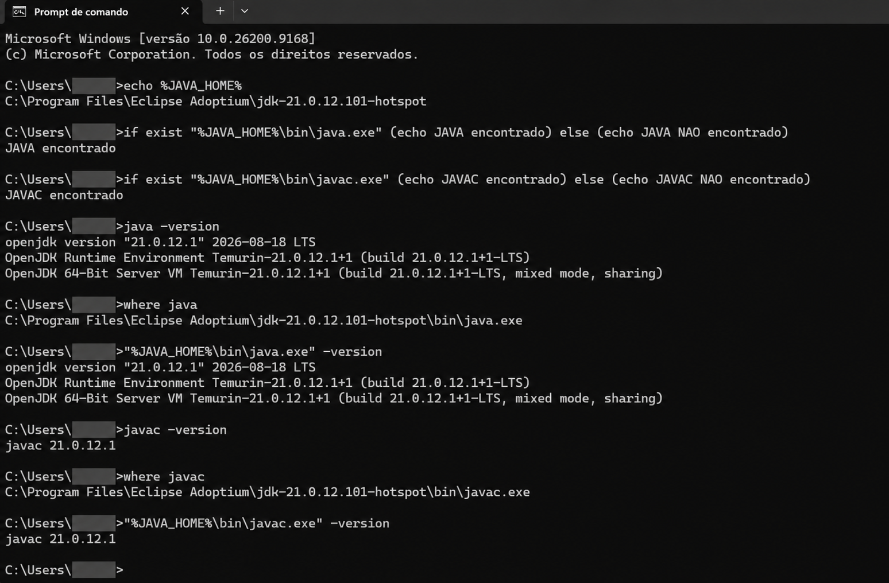

*Figura 23 — Validação completa da instalação, de `JAVA_HOME`, do `Path`, de `java` e de `javac`.*

Na Figura 23, todos os resultados esperados foram obtidos: `JAVA_HOME` aponta para o JDK 21, os dois executáveis foram encontrados, `java` e `javac` apresentam a versão principal 21 e os comandos `where` apontam para a instalação do Eclipse Temurin.

## Parte 12 — Diagnóstico de problemas comuns

### Problema 1 — echo mostra literalmente %JAVA_HOME%

**Sintoma:**

```text
%JAVA_HOME%
```

**Verificações:**

1. Confirme que está usando o Prompt de Comando, e não o PowerShell.
2. Feche a janela atual e abra um novo Prompt de Comando.
3. Reabra as Variáveis de Ambiente.
4. Confirme que a variável se chama `JAVA_HOME`, sem espaços antes ou depois.
5. Confirme que o valor não está vazio.
6. Clique em **OK** em todas as janelas.

### Problema 2 — java não é reconhecido como comando

**Sintoma aproximado:**

```text
'java' não é reconhecido como um comando interno ou externo...
```

**Verificações:**

1. Execute `echo %JAVA_HOME%` e confirme o caminho.
2. Execute os testes `if exist` apresentados anteriormente.
3. Reabra a edição da variável `Path`.
4. Confirme que existe exatamente `%JAVA_HOME%\bin`.
5. Confirme que a entrada está em uma linha própria.
6. Feche e abra novamente o Prompt de Comando.
7. Se necessário, saia da conta do Windows e entre novamente. Use a reinicialização somente se os novos processos continuarem recebendo os valores antigos.

### Problema 3 — java funciona, mas javac não é reconhecido

Isso normalmente indica que foi instalado apenas um ambiente de execução ou que `java` está sendo encontrado em outra pasta.

1. Execute:

   ```bat
   where java
   where javac
   ```

2. Confirme no Explorador de Arquivos que existem `java.exe` e `javac.exe` dentro de `%JAVA_HOME%\bin`.
3. Se `javac.exe` não existir, instale o pacote identificado como **JDK 21**, e não `JRE 21`.
4. Se `javac.exe` existir, revise a entrada `%JAVA_HOME%\bin` no `Path`.

### Problema 4 — os comandos mostram Java 8, 11, 17 ou outra versão

1. Execute:

   ```bat
   where java
   where javac
   ```

2. Observe o primeiro caminho de cada lista.
3. Abra a edição do `Path`.
4. Mova `%JAVA_HOME%\bin` para cima das entradas de outras versões do Java.
5. Não exclua versões antigas. Procure o instrutor se elas impedirem o uso do Java 21.
6. Confirme as janelas com **OK**.
7. Abra um novo Prompt de Comando e repita os testes.

### Problema 5 — JAVA_HOME está correto, mas Path usa outra pasta

1. Execute:

   ```bat
   echo %JAVA_HOME%
   where java
   ```

2. Compare os caminhos.
3. Se `where java` mostrar primeiro um diretório diferente de `%JAVA_HOME%\bin`, ajuste a ordem do `Path`.
4. Verifique tanto o `Path` do usuário quanto o `Path` do sistema, pois os dois participam do ambiente final.
5. Não remova entradas do `Path` do sistema. Se houver conflito, procure o instrutor.

### Problema 6 — acesso negado ou opções bloqueadas

Se o instalador, a pasta ou as Variáveis de Ambiente estiverem bloqueados:

1. Não altere permissões de pastas do Windows.
2. Não desative antivírus nem controles de segurança.
3. Não copie manualmente executáveis de outro computador.
4. Registre uma captura de tela ou copie a mensagem de erro.
5. Procure o instrutor e apresente a mensagem de erro.

### Problema 7 — o caminho do JDK mudou após uma atualização

Algumas atualizações podem instalar o JDK em uma nova pasta cujo nome contém um número de atualização diferente.

1. Abra `C:\Program Files\Eclipse Adoptium`.
2. Identifique a pasta atual do JDK 21.
3. Confirme a existência de `bin\java.exe` e `bin\javac.exe`.
4. Atualize `JAVA_HOME` para a nova pasta.
5. Como o `Path` usa `%JAVA_HOME%\bin`, normalmente não será necessário alterar sua entrada.
6. Abra um novo Prompt de Comando e repita todos os testes.

## Checklist final obrigatório

Marque cada item somente depois de verificá-lo:

- [ ] Todo o procedimento foi realizado no computador físico, e não na VDI.
- [ ] O Windows é de 64 bits com processador x64.
- [ ] O pacote instalado é o JDK 21, e não apenas um JRE.
- [ ] A pasta principal do JDK contém `bin\java.exe`.
- [ ] A pasta principal do JDK contém `bin\javac.exe`.
- [ ] `JAVA_HOME` aponta para a pasta principal `jdk-21...`.
- [ ] `JAVA_HOME` não termina em `\bin`.
- [ ] O valor de `JAVA_HOME` não contém aspas.
- [ ] O `Path` contém uma única entrada `%JAVA_HOME%\bin` na área escolhida.
- [ ] `%JAVA_HOME%\bin` aparece antes de caminhos de outras versões do Java quando necessário.
- [ ] Um novo Prompt de Comando foi aberto depois da configuração.
- [ ] `echo %JAVA_HOME%` mostra a pasta real do JDK 21.
- [ ] `java -version` mostra a versão principal 21.
- [ ] `javac -version` mostra a versão principal 21.
- [ ] O primeiro resultado de `where java` aponta para o JDK 21 esperado.
- [ ] O primeiro resultado de `where javac` aponta para o mesmo JDK 21.

## Registro para envio ou conferência

Se o instrutor solicitar evidência da preparação, execute os comandos abaixo em uma nova janela do Prompt de Comando:

```bat
echo %JAVA_HOME%
where java
where javac
java -version
javac -version
```

Tire uma captura de tela que mostre os comandos e os resultados. Antes de enviar, confira se a imagem não expõe identificadores do computador, dados de conta, endereços de e-mail ou outras informações que não sejam necessárias para a validação.

## Fontes oficiais consultadas

- Eclipse Adoptium. [Windows MSI installer packages](https://adoptium.net/installation/windows/).
- Eclipse Adoptium. [Download do Eclipse Temurin JDK](https://adoptium.net/temurin/releases/).
- Microsoft Learn. [Comando set e variáveis de ambiente no Windows](https://learn.microsoft.com/windows-server/administration/windows-commands/set_1).
